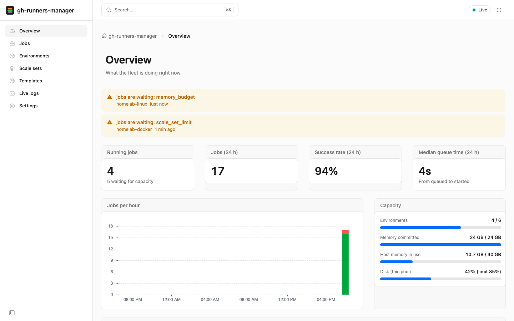
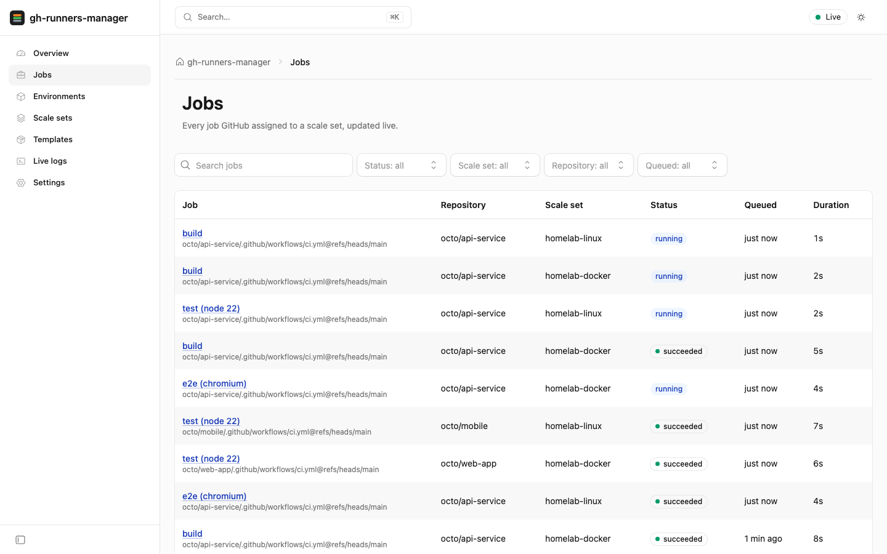
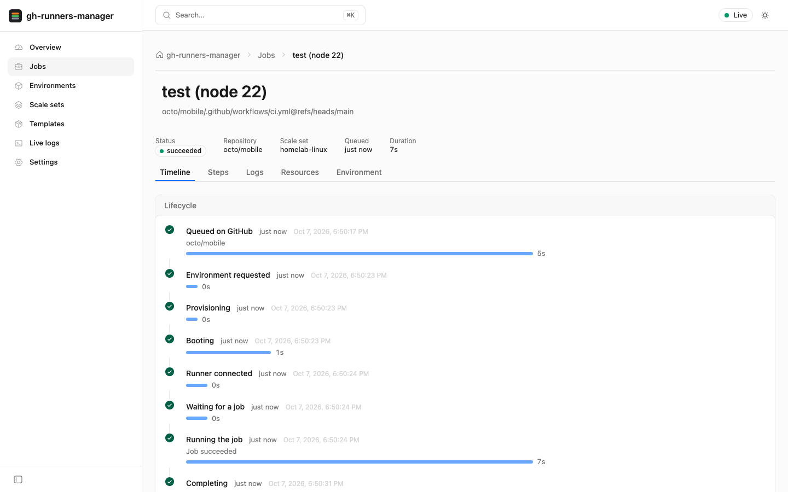
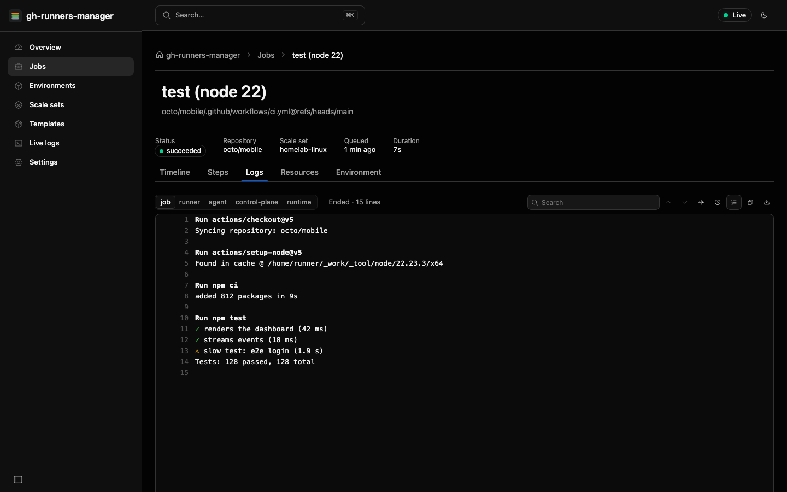
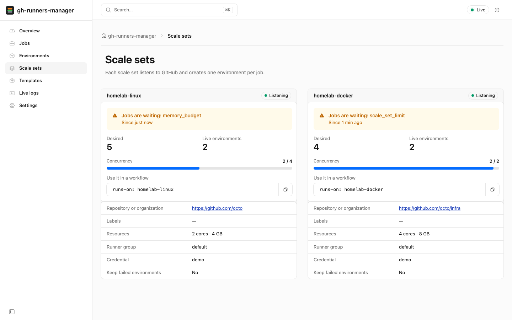
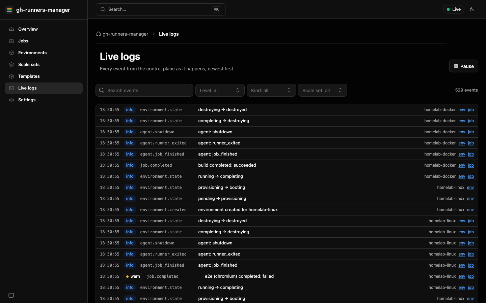
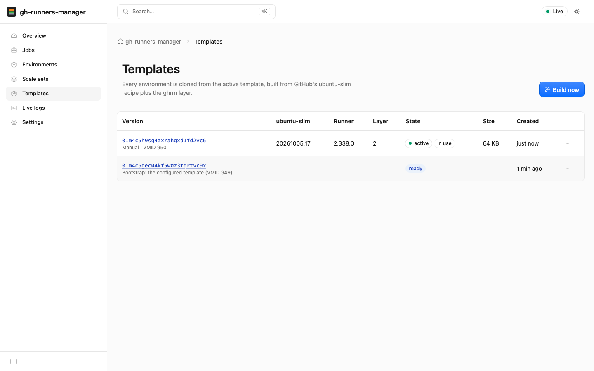
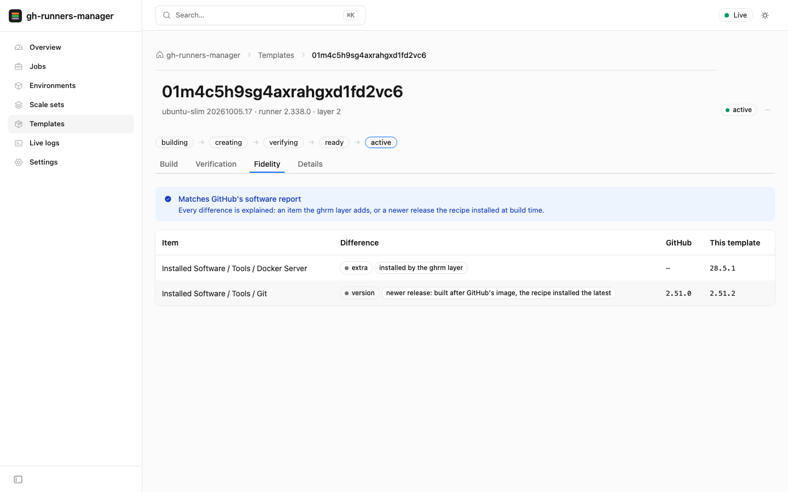

# gh-runners-manager

Ephemeral, isolated GitHub Actions runners on Proxmox LXC: one fresh environment per job, destroyed when the job ends, with a real-time web UI.

> **Status:** early development. Not ready for production use.

## How it works

- Jobs are received through GitHub's Runner Scale Set API (outbound connections only).
- Each job runs in an unprivileged LXC container, linked-cloned from a template that ghrm builds from GitHub's own `ubuntu-slim` image recipe, verifies against GitHub's software report, and rebuilds when a new image or runner release appears.
- Job environments live on an isolated network that cannot reach your LAN or the hypervisor.
- A web UI shows queues, environments, jobs and the live logs of every lifecycle stage.

## Install

On a Proxmox VE 9.1+ host, as root:

    curl -fsSLO https://github.com/cocardoso/gh-runners-manager/releases/latest/download/install.sh
    bash install.sh --dry-run    # shows what it would create
    bash install.sh

It creates a dedicated Proxmox user and token, an isolated job network, the control-plane container and a bootstrap template, then prints the web UI address and a one-time setup token. Sign in, add a GitHub credential (a fine-grained PAT) and a scale set, build the first template, and use `runs-on: <scale set>` in your workflows. Running it again upgrades ghrm. See `bash install.sh --help` for the options, and [docs/development.md](docs/development.md) for the manual setup and Docker Compose.

## Web UI

The UI is embedded in the `ghrm` binary and follows the Cloudflare dashboard patterns, built with [Kumo](https://github.com/cloudflare/kumo). Everything updates live over server-sent events.

| Overview | Jobs |
| --- | --- |
|  |  |
| **Job timeline** | **Live job log** |
|  |  |
| **Scale sets** | **Live logs** |
|  |  |
| **Templates** | **Template fidelity report** |
|  |  |

Dark versions of every screenshot are in [docs/images](docs/images).

## Documentation

- [Architecture diagrams](docs/architecture.md): system overview, network isolation, job lifecycle, environment states and implementation status. Kept up to date with every change.
- [Design document](docs/superpowers/specs/2026-10-07-gh-runners-manager-design.md): the reasoning behind the design.
- [Development guide](docs/development.md): building, testing and running against a Proxmox host.

## Development

Requirements: Go 1.27+, and Node.js 22 with pnpm for the web UI.

    make web     # build the UI into web/dist (embedded by the next Go build)
    make check   # vet, test (with -race) and build
    make build   # produces bin/ghrm

`go build` works without Node.js: the binary then serves a page explaining how to build the UI.

To work on the UI, run a simulated fleet and the Vite dev server:

    go run ./cmd/ghrm demo            # API and a simulated fleet on 127.0.0.1:8080 (admin token: demo)
    cd web && pnpm dev                # http://localhost:5173, proxies /api to the demo

    cd web && pnpm test               # unit and component tests (Vitest)
    cd web && pnpm build && pnpm e2e  # browser tests (Playwright) against ghrm demo
    cd web && pnpm screenshots        # refresh docs/images
