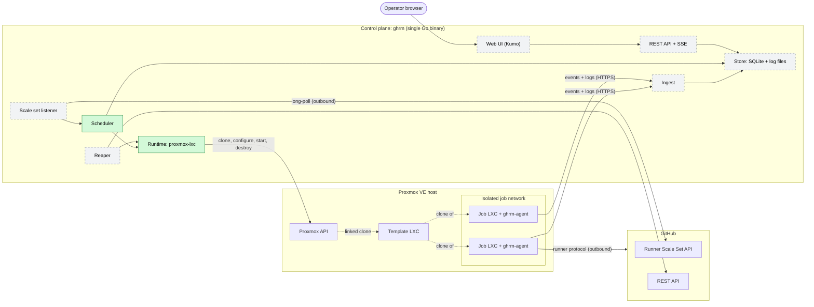
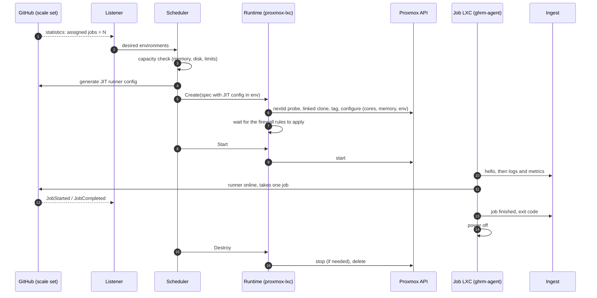
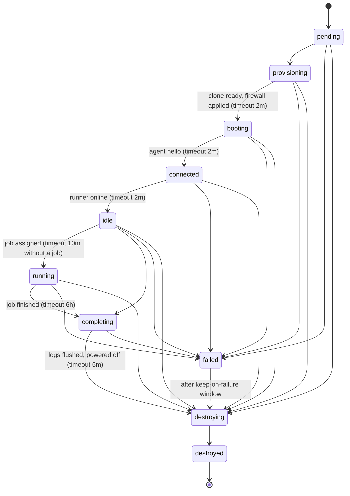
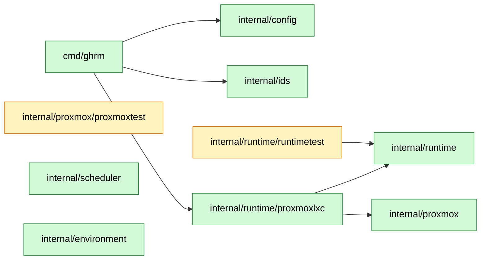
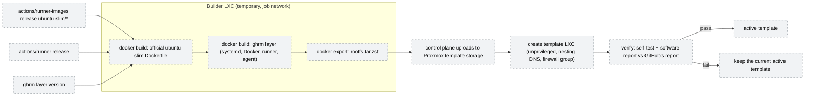

# Architecture

This document holds the architecture diagrams of gh-runners-manager (`ghrm`). It is updated in the same change as any code that alters components, flows, networking or states. The [design document](superpowers/specs/2026-10-07-gh-runners-manager-design.md) explains the reasoning behind the design.

Legend used in the diagrams: **green** = implemented, **grey dashed** = planned (with its milestone).

## Implementation status

| Component | Package / location | Status |
|---|---|---|
| Configuration | `internal/config` | Implemented (M1) |
| Environment state machine | `internal/environment` | Implemented (M1) |
| Capacity scheduler (pure logic) | `internal/scheduler` | Implemented (M1) |
| Runtime interface and in-memory fake | `internal/runtime`, `internal/runtime/runtimetest` | Implemented (M1) |
| Proxmox API client and fake server | `internal/proxmox`, `internal/proxmox/proxmoxtest` | Implemented (M1) |
| `proxmox-lxc` runtime | `internal/runtime/proxmoxlxc` | Implemented (M1) |
| `ghrm version`, `ghrm smoke` | `cmd/ghrm` | Implemented (M1) |
| Store (SQLite) and event bus | `internal/store`, `internal/events` | Planned (M2) |
| Scale set listener (`actions/scaleset`) | `internal/scaleset` | Planned (M2) |
| Controller and reaper | — | Planned (M2) |
| Agent and ingest | `cmd/ghrm-agent`, `internal/ingest` | Planned (M2) |
| REST API and SSE | `internal/api` | Planned (M2) |
| Web UI (React, Kumo) | `web/` | Planned (M3) |
| Template builder (`ubuntu-slim`) | `internal/template`, `template/layer` | Planned (M4) |
| UI auth, secrets, installer | `internal/auth`, `internal/secrets`, `deploy/` | Planned (M5) |

## 1. System overview

## 2. Network and isolation

Security group applied to every job LXC (inherited from the template):

| Order | Direction | Rule |
|---|---|---|
| 1 | out | ACCEPT UDP 67 (DHCP) |
| 2 | out | ACCEPT TCP to the ingest address and port (planned, M2) |
| 3 | in | DROP everything |
| 4 | out | DROP 10.0.0.0/8, 172.16.0.0/12, 192.168.0.0/16, 169.254.0.0/16 |
| — | out | everything else (internet) is allowed |

Nothing can open a connection into a job LXC (rule 3). The ingest exception (rule 2) is the only internal destination a job can reach.

## 3. Job lifecycle

Steps 4–8 and 10 exist today in `internal/runtime/proxmoxlxc` and are exercised by `ghrm smoke`. The listener, scheduler wiring, agent and ingest arrive in M2.

## 4. Environment states

Implemented in `internal/environment`. Every state with a timeout is enforced by the reaper (M2).

## 5. `proxmox-lxc` runtime: create and destroy

How the runtime avoids leaking guests and never touches guests it does not own.

## 6. Code map

`internal/scheduler` and `internal/environment` have no dependencies; the controller (M2) will connect them to the runtime and the store. Yellow packages are test doubles used only by tests.

## 7. Template pipeline (planned, M4)

