# Architecture

This document holds the architecture diagrams of gh-runners-manager (`ghrm`). It is updated in the same change as any code that alters components, flows, networking or states. The [design document](design.md) explains the reasoning behind the design.

## Components

| Component | Package / location |
|---|---|
| Configuration | `internal/config` |
| Environment state machine | `internal/environment` |
| Capacity scheduler (pure logic) | `internal/scheduler` |
| Runtime interface and in-memory fake | `internal/runtime`, `internal/runtime/runtimetest` |
| Proxmox API client and fake server | `internal/proxmox`, `internal/proxmox/proxmoxtest` |
| `proxmox-lxc` runtime | `internal/runtime/proxmoxlxc` |
| Store (SQLite) | `internal/store` |
| Event bus and recorder | `internal/events` |
| Log store (files + follow) | `internal/logs` |
| Scale set adapter (`actions/scaleset`) | `internal/github` |
| Controller and reaper | `internal/controller` |
| Ingest (TLS, per-environment tokens) | `internal/ingest` |
| Agent | `cmd/ghrm-agent`, `internal/agent` |
| REST API and SSE | `internal/api` |
| `ghrm version`, `smoke`, `serve`, `openapi`, `demo` | `cmd/ghrm` |
| Simulated fleet for UI work and browser tests | `internal/demo` |
| Web UI (React, Kumo), embedded in the binary | `web/` |
| UI languages (typed dictionaries, one file per area with every language) | `web/src/i18n` |
| Template builder (`ubuntu-slim`): build, verify, activate, retain, release checks | `internal/template`, `template/layer` |
| Agent build and self-test modes | `internal/agent` (`build.go`, `selftest.go`) |
| Sign-in: admin account (argon2id), sessions, CSRF, audit | `internal/auth`, `internal/api/auth.go` |
| Secrets sealed at rest (AES-256-GCM, separate key file), `ghrm secret` | `internal/secrets` |
| Editable credentials and scale sets, listener supervisor | `internal/settings`, `cmd/ghrm/supervisor.go` |
| Repository picker and token check: what a credential can register runners for (`GET /api/v1/credentials/{name}/targets`, `POST /api/v1/credentials/check`) | `internal/github/targets.go`, `internal/api/credential_targets.go` |
| Prometheus metrics, daily backups | `internal/metrics`, `internal/backup` |
| Repositories view: scale sets and job activity per GitHub repository or organization (`GET /api/v1/repositories`) | `internal/api/repositories.go`, `internal/store/activity.go` |
| History retention: daily or manual cleanup of finished environments, jobs, events, logs and failed template records | `internal/retention`, `internal/store/history.go` |
| Registry cache: proxies, eviction, disk exporter, monitor, mirror settings in templates | `internal/cachemon`, `internal/agent` (`cacheprune.go`, `cacheexporter.go`), `template/layer/mirrors.sh` |
| Installer, container image, releases | `deploy/proxmox/install.sh`, `Dockerfile`, `deploy/docker`, `.github/workflows/release.yml` |

## 1. System overview

```mermaid
flowchart LR
    subgraph github["GitHub"]
        ss["Runner Scale Set API"]
        rest["REST API"]
    end

    subgraph cp["Control plane: ghrm (single Go binary)"]
        settings["Settings: file + UI credentials and scale sets"]
        vault["Vault: secrets sealed with a separate key file"]
        auth["Sign-in: account, sessions, CSRF"]
        metrics["/metrics, daily backups, history cleanup"]
        listener["Scale set listeners (supervised)"]
        scheduler["Scheduler"]
        runtime["Runtime: proxmox-lxc"]
        reaper["Reaper"]
        templates["Template service"]
        store["Store: SQLite + log files"]
        ingest["Ingest"]
        api["REST API + SSE"]
        ui["Web UI (Kumo)"]
    end

    subgraph pve["Proxmox VE host"]
        pveapi["Proxmox API"]
        tmpl["Active template LXC"]
        tmplstore["Template storage (vztmpl archives)"]
        subgraph jobnet["Isolated job network"]
            env1["Job LXC + ghrm-agent"]
            env2["Job LXC + ghrm-agent"]
            builder["Builder / verify LXC + ghrm-agent (build, self-test mode)"]
            cache["Registry cache LXC: one proxy per registry<br/>(Docker Hub, GHCR, MCR, Quay)"]
        end
    end

    operator(["Operator browser"])

    listener -- "long-poll (outbound)" --> ss
    listener --> scheduler
    scheduler --> runtime
    runtime -- "clone, configure, start, destroy" --> pveapi
    pveapi -. "linked clone" .-> tmpl
    tmpl -. "clone of" .-> env1
    tmpl -. "clone of" .-> env2
    env1 -- "events + logs (HTTPS)" --> ingest
    env2 -- "events + logs (HTTPS)" --> ingest
    env1 -- "runner protocol (outbound)" --> github
    env1 -- "image pulls (mirrors)" --> cache
    cache -- "first pull only" --> registries(["Container registries"])
    templates -. "health, hits, disk" .-> cache
    reaper --> runtime
    reaper --> rest
    templates -- "release checks" --> rest
    templates -- "upload archive, create, convert" --> pveapi
    pveapi -.-> tmplstore
    tmpl -. "clone of" .-> builder
    builder -- "build log, root filesystem, self-test report" --> ingest
    ingest --> templates
    ingest --> store
    scheduler --> store
    api --> store
    ui --> api
    operator --> ui
    api --> auth
    api --> settings
    settings --> vault
    settings -- "start, restart, stop" --> listener
    metrics --> store

    classDef done fill:#d3f9d8,stroke:#2b8a3e,color:#000
    class runtime,scheduler,listener,reaper,store,ingest,api,ui,templates,settings,vault,auth,metrics,cache done
```

## 1a. Web UI data flow

The UI is a single-page app embedded in `ghrm` (`web/embed.go`) and served for every non-API path. Server state is fetched over REST through a client generated from the OpenAPI document. One shared event stream keeps every page live by invalidating the queries an event affects; each open log view has its own stream.

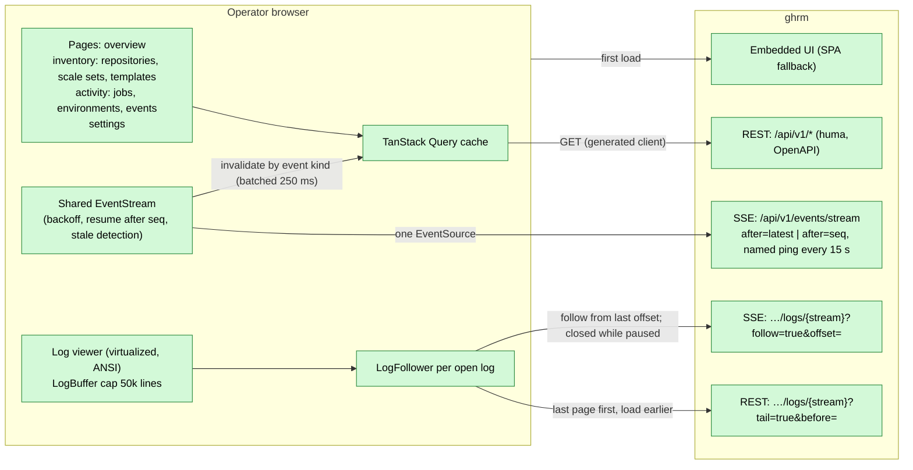

- A fresh page starts the event stream at `after=latest` and reconnects with `after=<last seq>`, so a control-plane restart or a network blip replays what was missed. A connection that stays silent past two heartbeats is treated as stale and replaced; the Live indicator shows `Reconnecting` meanwhile.
- Every API call needs a signed-in session (or the admin bearer token, for scripts). The shell checks the session first and shows the first-run form or the sign-in form in place of the page; writes send the session's CSRF token, and a 401 shows the sign-in form again.
- Mutating actions (destroy an environment, build, activate or pin a template, edit credentials and scale sets) are recorded as `audit.*` events with the actor.

## 1b. Sign-in and API access

```mermaid
sequenceDiagram
    autonumber
    participant B as Browser
    participant A as API middleware
    participant S as auth.Service
    participant D as SQLite

    B->>A: GET /api/v1/auth/session
    A->>S: needs setup? / session from cookie
    S->>D: users, sessions (cookie stored as its SHA-256)
    A-->>B: setup | signed_out | signed_in + CSRF token
    alt first run
        B->>A: POST /auth/setup (setup token from data_dir/setup-token)
        A->>S: create the admin (argon2id), remove the setup token
    end
    B->>A: POST /auth/login
    A->>S: verify (per-address lockout after 5 failures)
    A-->>B: Set-Cookie ghrm_session (HttpOnly, SameSite=Strict, Secure behind HTTPS)
    B->>A: POST /api/v1/... + X-CSRF-Token
    A->>S: session (slides its expiry), CSRF check
    A->>A: handler; audit.* event with the actor
    Note over A: scripts send Authorization: Bearer <admin token> instead (no CSRF)
```

## 1c. Editable settings

Credentials and scale sets come from two places: `ghrm.yaml` (read-only in the UI) and the UI (stored in SQLite; tokens sealed in the vault under `github/<name>`). A change applies without a restart. Template profiles are edited in the UI only (table `template_profiles`); a profile a scale set uses cannot be deleted, and the default one always exists.

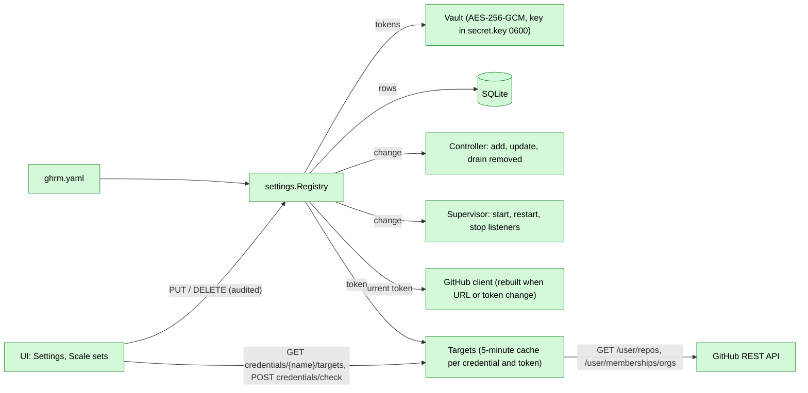

The scale set form picks the repository or organization from what the credential can register runners for: the repositories it administers (`/user/repos`, `permissions.admin`, up to 1,000, then the list says it is cut) and their organizations (only those it administers when the token may read its memberships). The list is cached for 5 minutes per credential and token hash (`?refresh=true` asks again unless the list is under 10 seconds old; two requests at once share one listing); a GitHub error answers 502 with GitHub's message, and the form falls back to typing the URL. `POST /api/v1/credentials/check` tests a token before it is saved: whose it is and how many repositories and organizations it reaches. A new scale set is saved with `If-None-Match: *`, so it never replaces one of the same name (412).

A removed scale set drains: its running environments finish, it gets no new ones, and its listener keeps running (with the last GitHub client and token, so job messages and runner removal still work) until the last environment is gone; then it disappears. It stays registered on GitHub (without runners) until deleted there.

## 2. Network and isolation

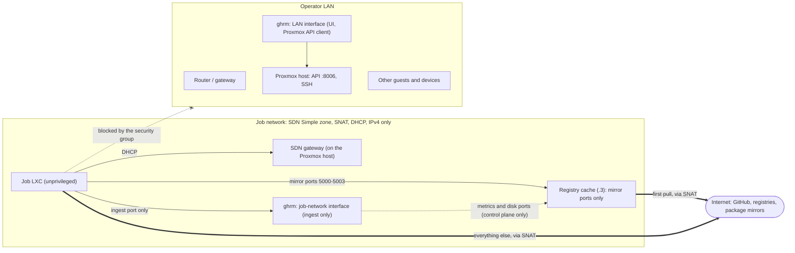

Security group applied to every job LXC (inherited from the template):

| Order | Direction | Rule |
|---|---|---|
| 1 | out | ACCEPT UDP 67 (DHCP) |
| 2 | out | ACCEPT TCP to the ingest address and port |
| 2b | out | ACCEPT TCP to the registry cache's mirror ports (5000–5003), when a cache is configured |
| 3 | in | DROP everything |
| 4 | out | DROP 10.0.0.0/8, 172.16.0.0/12, 192.168.0.0/16, 169.254.0.0/16 |
| — | out | everything else (internet) is allowed |

Nothing can open a connection into a job LXC (rule 3). The ingest (rule 2) and the registry cache's mirror ports (rule 2b) are the only internal destinations a job can reach; the cache's metrics and disk ports stay closed to jobs (the template self-test checks it).

### 2a. Registry cache

Job templates point the Docker daemon (`registry-mirrors`, Docker Hub), containerd (`/etc/docker/certs.d/<registry>/hosts.toml`) and BuildKit (`~/.docker/buildx/buildkitd.default.toml` of the runner user, read when `setup-buildx-action` creates a builder) at the cache, so `services:`, `container:`, `docker pull`, `docker build` and buildx pull through it with unchanged workflows. If the cache does not answer, pulls go straight to the registry. The cache container runs one CNCF Distribution proxy per registry; `ghrm-agent cache-prune` (every 15 minutes) evicts the least recently used repositories above 85 % of its disk budget, and `ghrm-agent cache-exporter` reports the disk use. The control plane polls it every 30 s for the overview alert, the Settings card and the `ghrm_cache_*` metrics. Changing the cache settings changes the layer version, so templates are rebuilt.

## 3. Job lifecycle

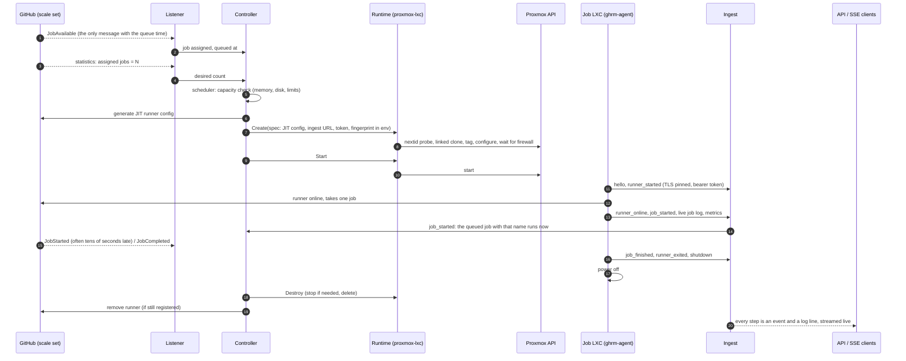

GitHub's JobStarted message lags the runner by 10–30 seconds, sometimes past the job's end, so the agent's `job_started` marks the job running: it carries the job's name, which is matched to the scale set's one job with that name queued in the last 24 hours (two such jobs, as in a matrix or an organization's repositories, wait for GitHub's message). Both sides claim the job with one conditional update, so only one records the start; GitHub's message then completes the record and never reopens a finished job. A job still queued after 24 hours, which GitHub has canceled, is closed as canceled.

A guest starts without waiting for `pve-firewall` when its template's agent gates the runner itself. The control plane serves a probe on the ingest port + 1, which the job security group drops, and passes it as an IP address in `GHRM_FIREWALL_PROBE`. Every 500 ms the agent opens three connections to it at once; once the probe has answered (connected or refused), a round where all three time out means the group applies, and the runner starts. A host unreachable, a slow resolver or a single lost SYN is no proof. A probe that never answered proves nothing, so the agent then keeps the `firewall_settle` delay from its own start (`GHRM_FIREWALL_SETTLE`); a probe still answering after 60 s fails the environment at stage `firewall` (a guest stopped meanwhile reports nothing). A template gates only when its verification proves it: the agent reports the `firewall-gate` feature and the self-test finds the probe dropped (a warning otherwise, with a `template.firewall_delay` event). Build and verify environments, the bootstrap template, templates not proved, a probe that could not bind, and an ingest advertised on another port than it listens on keep the delay before the start. The group must DROP the probe: Proxmox's REJECT answers with a reset.

Warm runners: a scale set's `warm_runners` are created before any job arrives, within `max_concurrent` (desired = min(assigned + warm, max_concurrent), or assigned alone above the limit). The scheduler serves assigned jobs first and gives warm runners only the capacity left, and missing warm runners never count as waiting jobs. The reaper keeps an idle runner past the idle timeout while its scale set has no more idle runners than `warm_runners`, oldest released first; it replaces a warm runner after an hour (a newer template), but not while jobs are queued, and a removed scale set keeps none.

Proxmox reads are sent up to three times when the answer is a passing server error (the LXC list answers 500 now and then while a guest starts or stops: `failed to read from command socket`; 502–504, 595 and 596 during a pveproxy reload) or the connection drops. A missing guest, a timeout and an answer that does not decode are final. The overview shares one capacity call for 5 seconds and keeps the last good answer for a minute, so a single failed call is not shown as an unreachable runtime; callers wait for the shared call only as long as their own request lives. A token that may not read `/disks/lvmthin` is asked again every 10 minutes, so a permission granted later takes effect without a restart.

Agent → ingest frames are NDJSON batches every 250 ms. Each log stream has its own sequence numbers, so a retried batch is stored once; an agent numbers from its start time in microseconds, so an agent that restarts (a builder updating itself) continues above its predecessor. Events share the `agent` stream's sequence and reach the controller exactly once.

## 3a. Where each log stream comes from

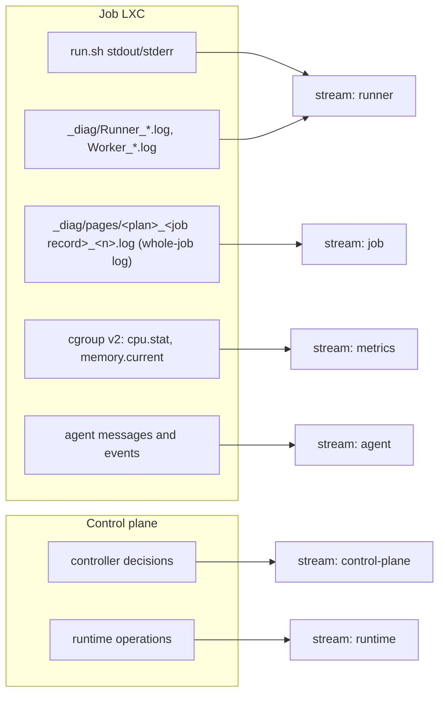

The runner writes one log per step and one for the whole job. The agent learns the job's record ID from the diagnostic log (`Job request … job <id> received`) and streams only the whole-job log, in numeric page order.

## 4. Environment states

Implemented in `internal/environment`; transitions are compare-and-set in the store. The reaper enforces every timeout. It concludes that a guest powered off silently only after 60 s in the state and a live status check, because the Proxmox LXC listing is cached and lags behind a start.

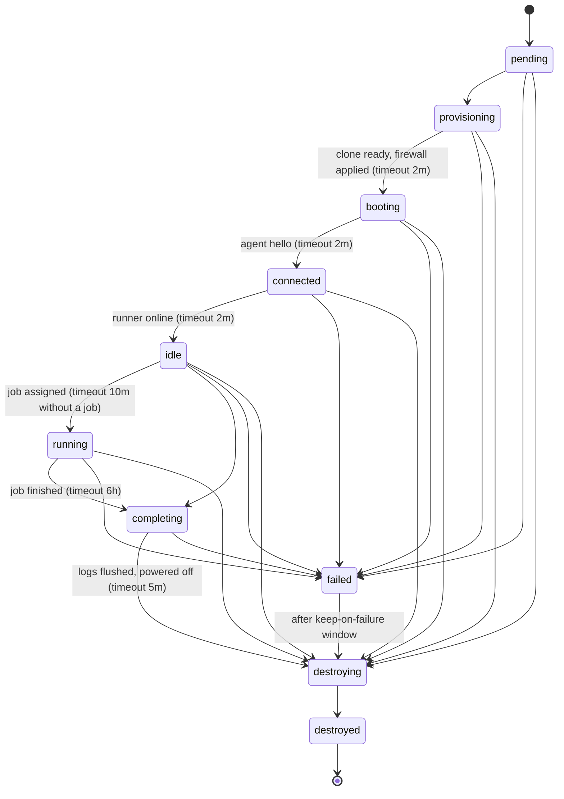

## 5. `proxmox-lxc` runtime: create and destroy

How the runtime avoids leaking guests and never touches guests it does not own.

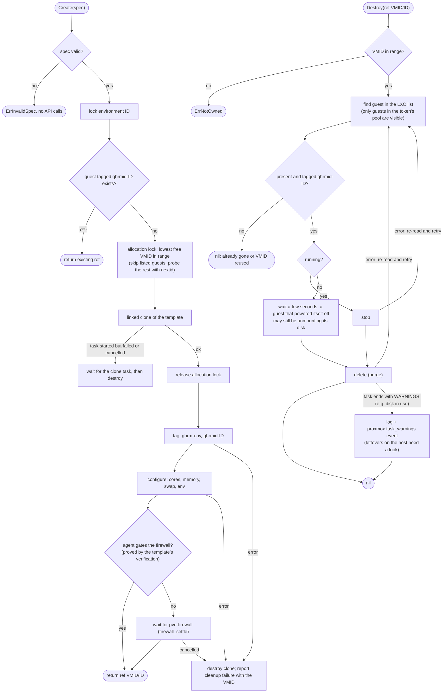

## 6. Code map

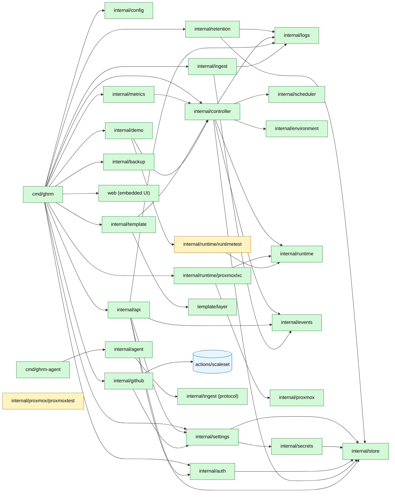

Yellow packages are test doubles; `internal/demo` uses the fake runtime to serve a simulated fleet (`ghrm demo`). `cmd/ghrm-agent` shares only the wire protocol with the control plane.

## 7. Template pipeline

Templates come in **profiles**. A profile says what of GitHub's recipe to leave out (its optional install scripts: the cloud CLIs, nvm, Node.js and Python on the PATH, yq, zstd, ...), what to preinstall in the hosted tool cache (Node.js, Python and Go versions, from the actions/*-versions manifests, so `actions/setup-*` finds them instead of downloading them in every job), extra Ubuntu packages and a build script. The `default` profile always exists: GitHub's recipe unchanged, plus Node.js 22 and 24 in the tool cache. Each profile has its own versions, one active at a time; a scale set picks its profile (`template_profile`) and clones that profile's active version, or the default profile's until it has one. The checker walks the profiles in order and builds one at a time: a profile is rebuilt when a release changes or its layer version does, which hashes the layer files, the agent, the cache settings and the profile. Leaving tools out shortens builds and saves disk; jobs do not start faster, as clones are linked.

A build clones the default profile's **active template** into a builder environment (it already has Docker, systemd and `ghrm-agent`), because the Proxmox API cannot run commands inside a fresh stock container. The very first template is the bootstrap template (`proxmox.template_vmid`), which the installer creates. Since the builder runs the active template's agent, which can be older than the control plane, it first replaces itself with the control plane's agent, so fixes to the build take effect in the next build.

The fidelity report compares the template's software report with the one GitHub publishes as an asset of the same `ubuntu-slim` release (the recipe's `ubuntu-slim-Report.json` is not refreshed for every release, so it is only a fallback). The recipe installs the latest releases at build time, so a build made after GitHub's shows newer versions: those differences are listed with their reason but do not hold the version back. A missing tool, an older version than GitHub's, a new major version of a language runtime, or an extra tool the layer does not install does; the tools a profile leaves out and the packages and cached versions it adds are explained by the profile.

```mermaid
flowchart LR
    rel["actions/runner-images release ubuntu-slim/*"] --> b1
    runner["actions/runner release + SHA-256"] --> b2
    layer["ghrm layer (template/layer, embedded in ghrm)"] --> b2
    subgraph builder["Builder LXC (clone of the active template, job network)"]
        b0["agent update: a builder whose ghrm-agent differs from the control plane's<br/>downloads it (GET /ingest/v1/build/agent), checks the SHA-256, re-executes"] --> b1
        b1["docker build: official ubuntu-slim Dockerfile<br/>(minus the install scripts the profile leaves out)"] --> b2["docker build: ghrm layer (systemd, Docker Engine, runner,<br/>profile.sh: apt packages, tool cache, script; agent)"]
        b2 --> b3["docker export, drop container markers, zstd, SHA-256"]
    end
    b3 -- "PUT /ingest/v1/build/rootfs (streamed, size-capped)" --> cp["control plane: verify SHA-256"]
    cp --> up["upload to template storage (Proxmox verifies the SHA-256)"]
    up --> create["create LXC: unprivileged, nesting (keyctl is reserved to root@pam), DNS, firewalled NIC, gh-runner group; convert to template"]
    create --> verify["verify LXC (clone): self-test + software report"]
    verify --> compare["compare with the report published with the release<br/>(asset internal.ubuntu-slim.json)"]
    compare -- "all checks pass, no unexpected differences, nothing pinned" --> active["active template"]
    compare -- "unexpected differences or pinned" --> ready["ready (manual activation)"]
    verify -- "a check fails, timeout" --> failed["failed: guests, template and archive removed"]
    b1 -- "builder stops, timeout, restart" --> failed
    b3 -- "bad SHA-256, too large" --> failed
    create -- "Proxmox error, restart" --> failed

    classDef done fill:#d3f9d8,stroke:#2b8a3e,color:#000
    class rel,runner,layer,b0,b1,b2,b3,cp,up,create,verify,compare,active,ready,failed done
```

### 7a. Template version states

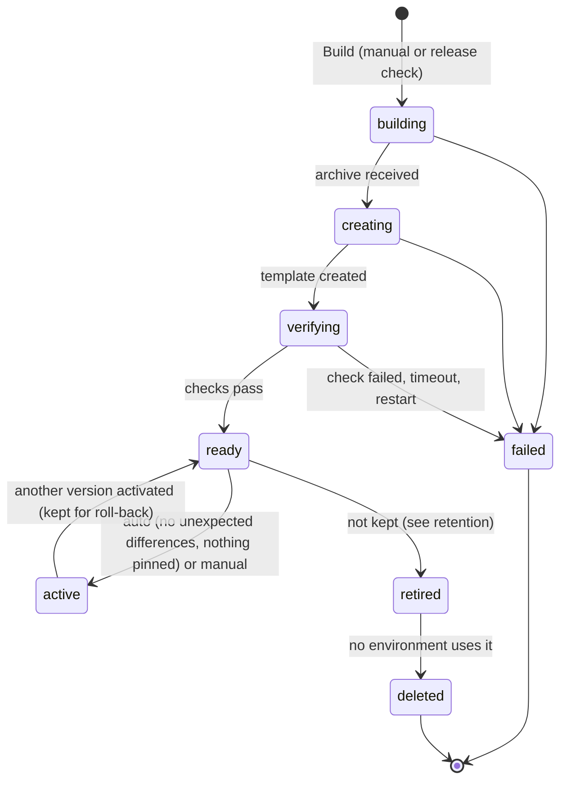

A failed build never changes the active template. Only one build runs at a time. The bootstrap template is never deleted.

Retention keeps the active version, the newest `keep - 1` versions that were active before (roll-back targets), the newest version that was never activated (awaiting review), and every pinned version. Other built versions are retired, and deleted once no environment uses them: neither a live environment recorded as cloned from the template nor a linked clone the hypervisor reports.

## 8. Deployment

`deploy/proxmox/install.sh` sets up a Proxmox VE host in one run; every step checks first, so it also resumes and upgrades (`--dry-run` shows what would change).

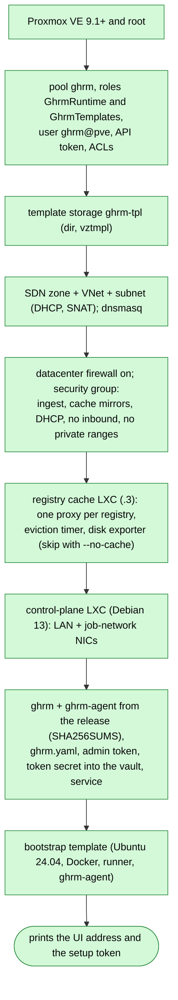

After the first sign-in, the operator adds a GitHub credential and a scale set and builds the first real template (Templates > Build now); ghrm then rebuilds templates on new releases by itself. The same image runs with Docker Compose (`deploy/docker/compose.yaml`) against a remote Proxmox host. A `v*` tag publishes the binaries, `SHA256SUMS`, the installer and the container image.
