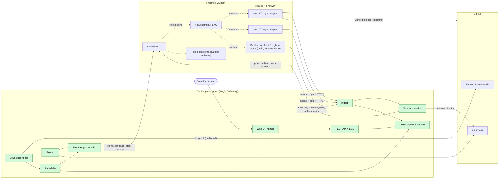
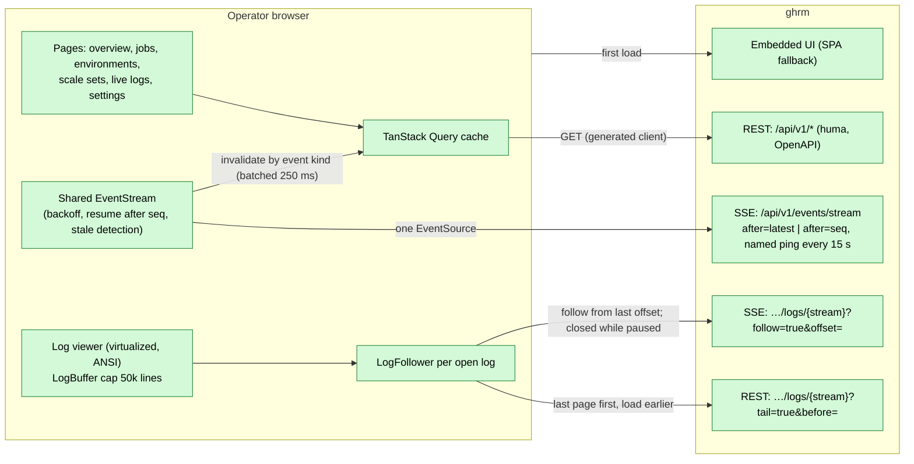
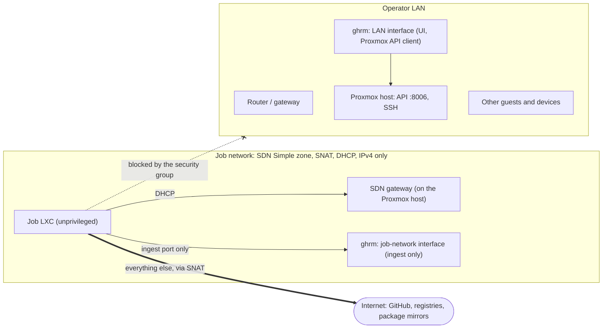
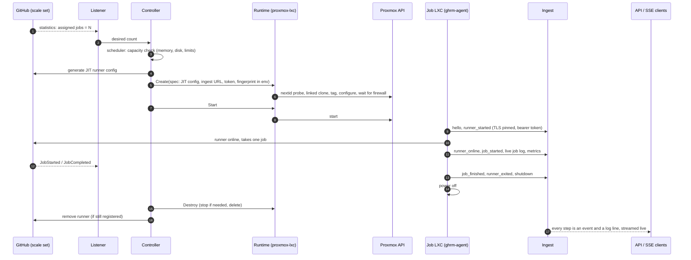
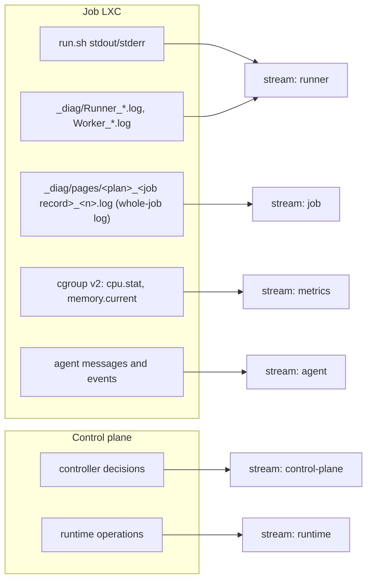
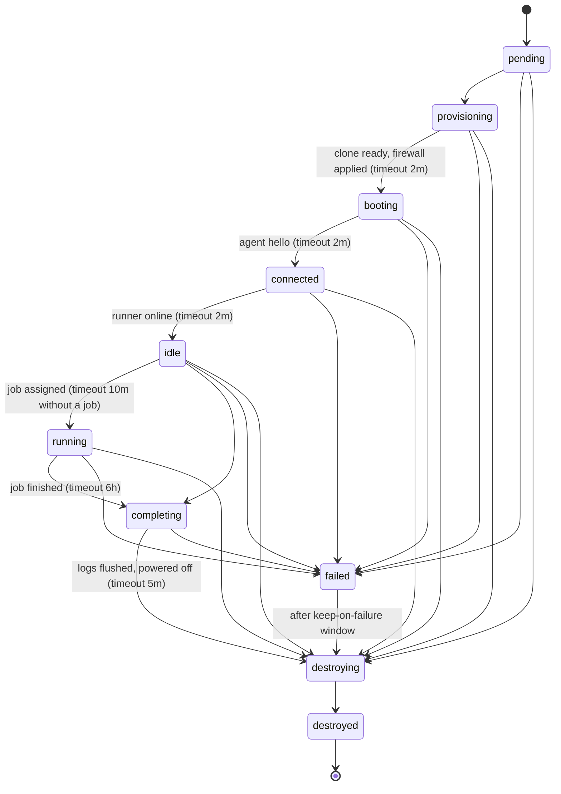
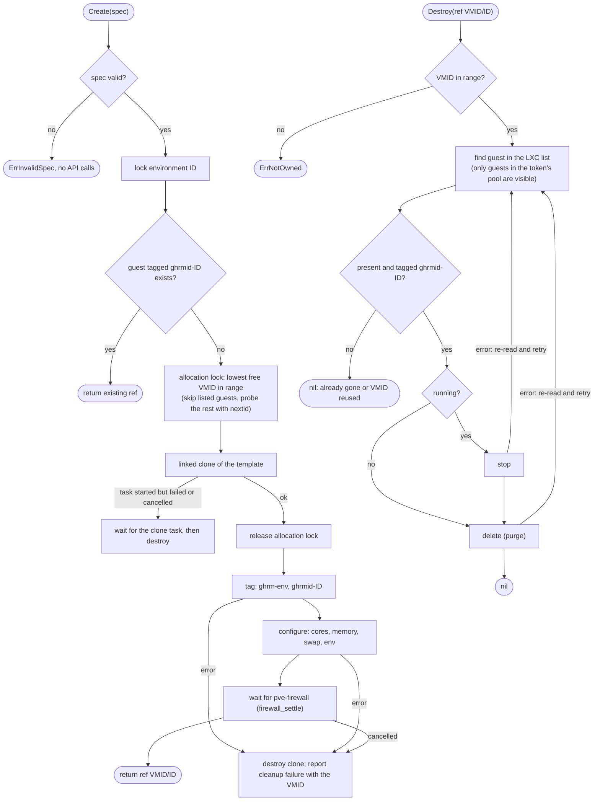
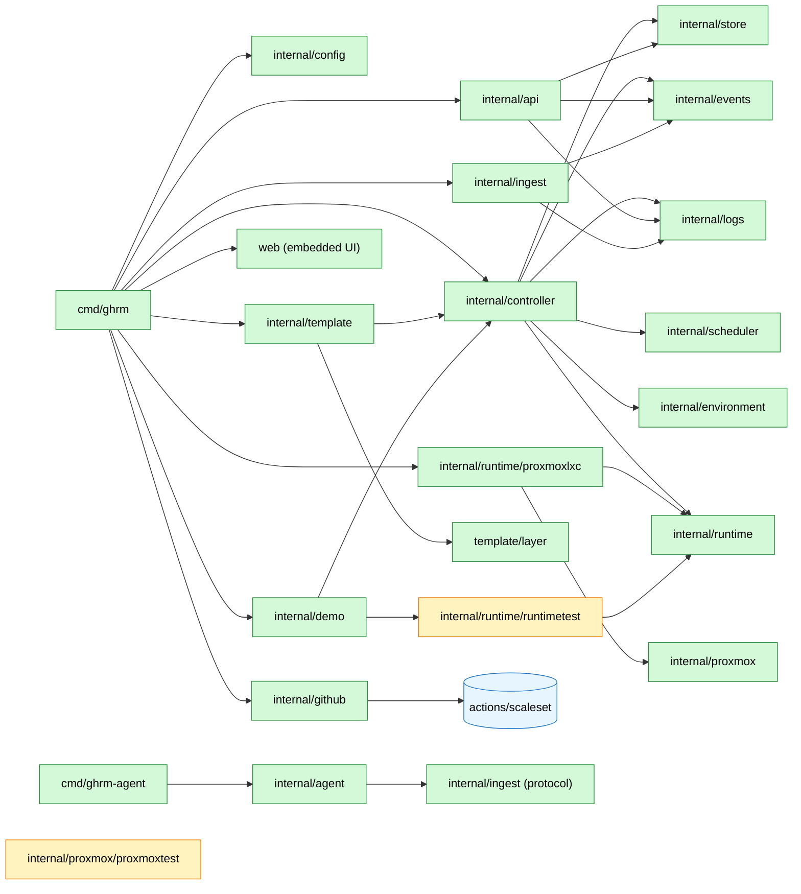
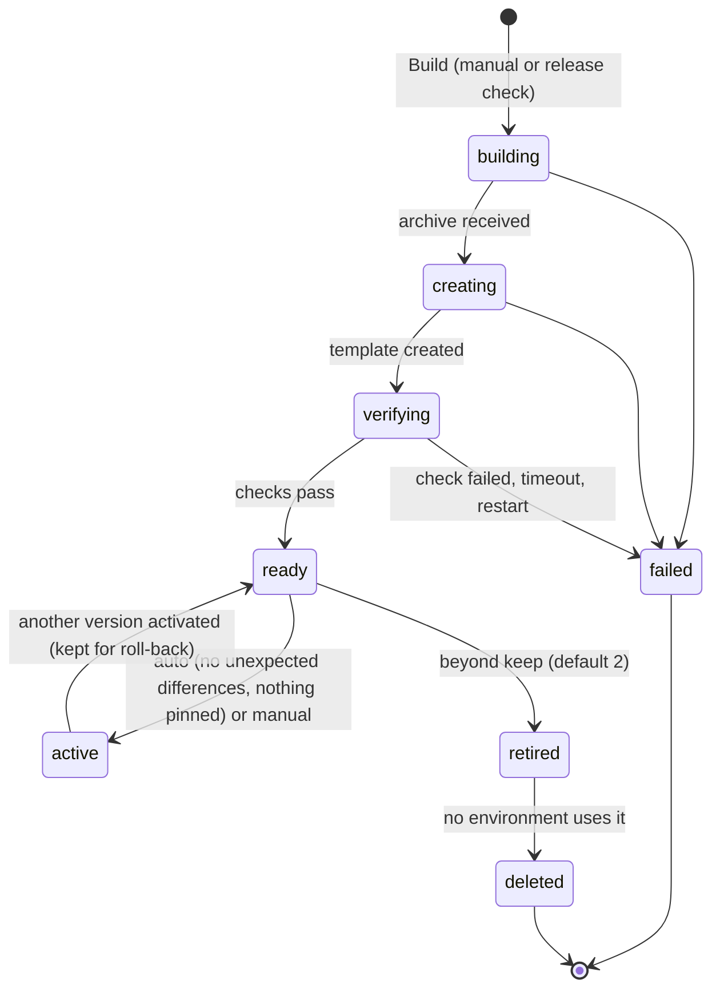

# Architecture

This document holds the architecture diagrams of gh-runners-manager (`ghrm`). It is updated in the same change as any code that alters components, flows, networking or states. The [design document](superpowers/specs/2026-10-07-gh-runners-manager-design.md) explains the reasoning behind the design.

Legend used in the diagrams: **green** = implemented, **grey dashed** = planned (with its milestone).

## Implementation status

| Component | Package / location | Status |
|---|---|---|
| Configuration | `internal/config` | Implemented (M1, M2) |
| Environment state machine | `internal/environment` | Implemented (M1) |
| Capacity scheduler (pure logic) | `internal/scheduler` | Implemented (M1) |
| Runtime interface and in-memory fake | `internal/runtime`, `internal/runtime/runtimetest` | Implemented (M1) |
| Proxmox API client and fake server | `internal/proxmox`, `internal/proxmox/proxmoxtest` | Implemented (M1) |
| `proxmox-lxc` runtime | `internal/runtime/proxmoxlxc` | Implemented (M1) |
| Store (SQLite) | `internal/store` | Implemented (M2) |
| Event bus and recorder | `internal/events` | Implemented (M2) |
| Log store (files + follow) | `internal/logs` | Implemented (M2) |
| Scale set adapter (`actions/scaleset`) | `internal/github` | Implemented (M2) |
| Controller and reaper | `internal/controller` | Implemented (M2) |
| Ingest (TLS, per-environment tokens) | `internal/ingest` | Implemented (M2) |
| Agent | `cmd/ghrm-agent`, `internal/agent` | Implemented (M2) |
| REST API and SSE | `internal/api` | Implemented (M2, paging and heartbeats M3) |
| `ghrm version`, `smoke`, `serve`, `openapi`, `demo` | `cmd/ghrm` | Implemented (M1–M3) |
| Simulated fleet for UI work and browser tests | `internal/demo` | Implemented (M3) |
| Web UI (React, Kumo), embedded in the binary | `web/` | Implemented (M3); template pages in M4, sign-in and editable settings in M5 |
| Template builder (`ubuntu-slim`): build, verify, activate, retain, release checks | `internal/template`, `template/layer` | Implemented (M4); `deploy/proxmox/dev-template.sh` creates the bootstrap template |
| Agent build and self-test modes | `internal/agent` (`build.go`, `selftest.go`) | Implemented (M4) |
| UI auth, secrets, installer | `internal/auth`, `internal/secrets`, `deploy/` | Planned (M5) |

## 1. System overview

## 1a. Web UI data flow

The UI is a single-page app embedded in `ghrm` (`web/embed.go`) and served for every non-API path. Server state is fetched over REST through a client generated from the OpenAPI document. One shared event stream keeps every page live by invalidating the queries an event affects; each open log view has its own stream.

- A fresh page starts the event stream at `after=latest` and reconnects with `after=<last seq>`, so a control-plane restart or a network blip replays what was missed. A connection that stays silent past two heartbeats is treated as stale and replaced; the Live indicator shows `Reconnecting` meanwhile.
- Destroying an environment is the only mutating action. It needs the admin token, kept in `sessionStorage` until M5 adds sign-in, and a type-the-name confirmation.

## 2. Network and isolation

Security group applied to every job LXC (inherited from the template):

| Order | Direction | Rule |
|---|---|---|
| 1 | out | ACCEPT UDP 67 (DHCP) |
| 2 | out | ACCEPT TCP to the ingest address and port |
| 3 | in | DROP everything |
| 4 | out | DROP 10.0.0.0/8, 172.16.0.0/12, 192.168.0.0/16, 169.254.0.0/16 |
| — | out | everything else (internet) is allowed |

Nothing can open a connection into a job LXC (rule 3). The ingest exception (rule 2) is the only internal destination a job can reach.

## 3. Job lifecycle

Agent → ingest frames are NDJSON batches every 250 ms. Each log stream has its own sequence numbers, so a retried batch is stored once. Events share the `agent` stream's sequence and reach the controller exactly once.

## 3a. Where each log stream comes from

The runner writes one log per step and one for the whole job. The agent learns the job's record ID from the diagnostic log (`Job request … job <id> received`) and streams only the whole-job log, in numeric page order.

## 4. Environment states

Implemented in `internal/environment`; transitions are compare-and-set in the store. The reaper enforces every timeout. It concludes that a guest powered off silently only after 60 s in the state and a live status check, because the Proxmox LXC listing is cached and lags behind a start.

## 5. `proxmox-lxc` runtime: create and destroy

How the runtime avoids leaking guests and never touches guests it does not own.

## 6. Code map

Yellow packages are test doubles; `internal/demo` uses the fake runtime to serve a simulated fleet (`ghrm demo`). `cmd/ghrm-agent` shares only the wire protocol with the control plane.

## 7. Template pipeline

A build clones the **active template** into a builder environment (it already has Docker, systemd and `ghrm-agent`), because the Proxmox API cannot run commands inside a fresh stock container. The very first template comes from `deploy/proxmox/dev-template.sh` (the bootstrap template, `proxmox.template_vmid`).

```mermaid
flowchart LR
    rel["actions/runner-images release ubuntu-slim/*"] --> b1
    runner["actions/runner release + SHA-256"] --> b1
    layer["ghrm layer (template/layer, embedded in ghrm)"] --> b2
    subgraph builder["Builder LXC (clone of the active template, job network)"]
        b1["docker build: official ubuntu-slim Dockerfile, unmodified"] --> b2["docker build: ghrm layer (systemd, Docker Engine, runner, agent)"]
        b2 --> b3["docker export, drop container markers, zstd, SHA-256"]
    end
    b3 -- "PUT /ingest/v1/build/rootfs (streamed, size-capped)" --> cp["control plane: verify SHA-256"]
    cp --> up["upload to template storage (Proxmox verifies the SHA-256)"]
    up --> create["create LXC: unprivileged, nesting, keyctl, DNS, firewalled NIC, gh-runner group; convert to template"]
    create --> verify["verify LXC (clone): self-test + software report"]
    verify --> compare["compare with GitHub's published report"]
    compare -- "all checks pass, no unexpected differences, nothing pinned" --> active["active template"]
    compare -- "unexpected differences or pinned" --> ready["ready (manual activation)"]
    verify -- "a check fails" --> failed["failed: guests, template and archive removed"]

    classDef done fill:#d3f9d8,stroke:#2b8a3e,color:#000
    class rel,runner,layer,b1,b2,b3,cp,up,create,verify,compare,active,ready,failed done
```

### 7a. Template version states

A failed build never changes the active template. Only one build runs at a time. The bootstrap template is never deleted.
