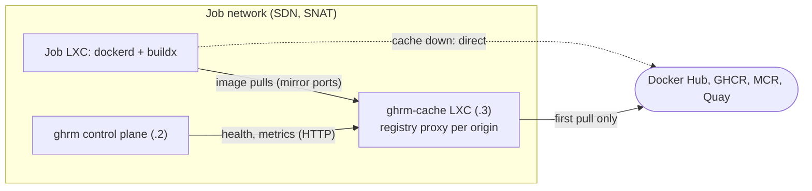

# M6 — Registry cache on the job network: design

Status: approved in conversation on 2026-10-07; this document records it. It extends the main design (`2026-10-07-gh-runners-manager-design.md`, risk #5 and §15 "a pull-through registry mirror").

## 1. Goal

Every job environment starts with an empty Docker image store, so every job downloads the same images from the internet again: service containers (`services:`), job containers (`container:`, such as the 2 GB Playwright image), Dockerfile base images, and the BuildKit image that `docker/setup-buildx-action` starts. All jobs leave through one public address (SNAT), so they also share Docker Hub's anonymous pull limit (100 pulls per 6 hours per address), which turns into failed jobs, not just slow ones.

M6 adds a pull-through registry cache on the job network that jobs use **without any change to their workflows**.

Success criteria:

- A second pull of the same image is served from the cache, for images from Docker Hub, GHCR, MCR and Quay.
- `services:`, `container:`, `docker pull`, `docker build` and buildx (`docker-container` driver, as `setup-buildx-action` creates it) use the cache with unchanged YAML.
- When the cache is down, jobs still work: pulls go straight to the origin.
- The cache never uses more than its disk budget (100 GB by default).
- Real jobs on the development host show the speed-up (pulls and the meu-mercado-style release build).

Out of scope: the GitHub Actions cache service (`actions/cache`, `cache: npm` of `setup-node`, BuildKit `type=gha`). Redirecting it would mean changing the runner, which breaks the fidelity goal. Package caches (npm, pip, apt) are out of scope for the same reason.

## 2. Spike results (development host, 2026-10-07)

A throwaway spike (one cache container, one clone of the active template) settled the open questions:

| Question | Result |
|---|---|
| Docker Hub through the daemon | `registry-mirrors` in `daemon.json` works. |
| GHCR, MCR, Quay through the daemon | Docker 29 with the containerd image store (the template's) honours `/etc/docker/certs.d/<registry>/hosts.toml` mirrors. Proven by the cache directories filling. |
| BuildKit (`docker-container` driver) | `~/.docker/buildx/buildkitd.default.toml` of the user that creates the builder is applied: base images of a multi-registry Dockerfile came through the cache, and so did the `moby/buildkit` image (through the daemon). |
| Speed, warm cache vs. internet | Playwright (MCR, 2 GB) 26.4 s → 15.6 s; actions-runner (GHCR) 37.9 s → 12.0 s; small images ~3 s → ~2 s; builder start + build 13.0 s → 4.7 s. What remains is unpacking, not network. |
| Resources | 163 MB of memory for the whole container (~60 MB per active origin, ~28 MB idle), CPU ~0 outside pulls. Disk: what is cached (thin-provisioned). |

To confirm with a real job: that `docker/setup-buildx-action` does not override the default BuildKit configuration (buildx reads `buildkitd.default.toml` when `--buildkitd-config` is not given).

## 3. Architecture



### 3.1 The cache container

- An unprivileged Debian 13 LXC named `ghrm-cache`, created by the installer: 1 vCPU, 512 MB of memory, a 100 GB root disk on the rootfs storage (thin-provisioned), one NIC on the job VNet with the fixed address `<subnet>.3` (the gateway is `.1`, the control plane's ingest `.2`, DHCP `.100–.199`).
- It is not in the `ghrm` pool, so the control plane's restricted token can neither see nor destroy it, like the control plane itself. Its NIC has no firewall group; only job environments are restricted.
- It runs the CNCF Distribution registry (`registry`, pinned version, checksum verified) in proxy mode, one systemd instance per origin, each with its own port and storage directory:

  | Origin | Upstream | Port |
  |---|---|---|
  | `docker.io` | `https://registry-1.docker.io` | 5000 |
  | `ghcr.io` | `https://ghcr.io` | 5001 |
  | `mcr.microsoft.com` | `https://mcr.microsoft.com` | 5002 |
  | `quay.io` | `https://quay.io` | 5003 |

  Each instance also exposes its Prometheus metrics on a local debug port (`5100 + n`).
- **Optional Docker Hub credential.** A Docker Hub username and access token raise the pull limit. They are configured only on the cache container (in the Docker Hub instance's `proxy.username/password`), never in job environments. The installer accepts them (`--dockerhub-user`, token read from standard input).

### 3.2 Disk budget and eviction

The registry expires proxied content by age (`proxy.ttl`, 168 h), not by size. A `ghrm-cache-prune` script on the cache container runs every 15 minutes (systemd timer). When the disk is above 85 % of the budget, it deletes the least recently used repositories (by the access time of their blobs' directories, since the proxy touches what it serves) until usage is below 70 %, then runs `registry garbage-collect` for that instance. The budget (default 100 GB) and the thresholds are in its configuration file.

### 3.3 Job environments use it

The ghrm layer (template build) writes, when a cache address is given:

- `/etc/docker/daemon.json`: `registry-mirrors: ["http://<cache>:5000"]` and the four cache ports in `insecure-registries` (plain HTTP inside the isolated job network).
- `/etc/docker/certs.d/<origin>/hosts.toml` for `ghcr.io`, `mcr.microsoft.com` and `quay.io`, pointing at their ports with `pull` and `resolve` capabilities.
- `/home/runner/.docker/buildx/buildkitd.default.toml` with the same four mirrors (and `http = true` for them).

With no cache configured, none of these files are written: templates stay as they are today.

The cache address and ports reach the layer as build arguments, and they are part of the layer version, so configuring, changing or removing the cache triggers a template rebuild (spec §8.5). If the cache is down, containerd and BuildKit fall back to the origin, so jobs keep working, only slower.

### 3.4 Firewall

The job security group gains one rule, placed with the ingest exception before the private-range drops: `OUT ACCEPT TCP to <cache>:5000-5003`. The installer adds it to a group it creates; for an existing group it adds this rule only when it is missing (an explicit, idempotent, additive change), and prints what it did. The debug ports are not opened to jobs.

### 3.5 Control plane

- Configuration:

  ```yaml
  cache:
    address: 10.50.0.3          # empty: no cache
    ports: {docker.io: 5000, ghcr.io: 5001, mcr.microsoft.com: 5002, quay.io: 5003}
    metrics_ports: {docker.io: 5100, ghcr.io: 5101, mcr.microsoft.com: 5102, quay.io: 5103}
  ```

  The installer writes it. The control plane reaches the cache's debug ports over the job network (it has a NIC there).
- The template service passes the cache to the layer build (§3.3) and adds two self-test checks: an image pulled through the cache reaches it (the pull appears in the instance's metrics), and the cache's debug port is **not** reachable from a job (only the mirror ports are).
- A cache monitor polls every 30 s: whether each instance answers, its hits and misses (from the proxy's blob request counters on its debug port), and the cache's disk usage. Disk usage comes from `ghrm-agent cache-exporter`, a small HTTP handler in the existing agent binary (no new binary) that the cache container runs on port 5199: it serves, in the Prometheus format, the used bytes and the budget that the prune script records. Jobs cannot reach the debug ports or 5199 (§3.4).
- `/metrics` gains `ghrm_cache_up`, `ghrm_cache_requests_total{origin,result="hit|miss"}` and `ghrm_cache_disk_bytes{kind="used|budget"}`; the overview alerts when the cache is configured and down; Settings shows a Cache card (address, per-origin state, disk used of budget, hit ratio).
- An event is recorded when the cache goes down or comes back.

### 3.6 Installer

New steps, idempotent like the others: the `ghrm-cache` container (`--cache-vmid`, `--cache-disk-gb` default 100, `--no-cache` to skip), the registry binary (pinned version and SHA-256), the instances, the prune timer and the exporter, the firewall rule, the `cache:` section of `ghrm.yaml` (added when missing), and the optional Docker Hub credential. A re-run changes nothing when everything is in place.

## 4. Failure behaviour

| Situation | Behaviour |
|---|---|
| Cache container down or unreachable | Jobs pull from the origin (slower); the overview shows an alert; `ghrm_cache_up` is 0. |
| Origin down | Cached images still serve (until they expire); uncached pulls fail, as they would without the cache. |
| Disk budget reached | Prune evicts least recently used repositories; pulls keep working. |
| Docker Hub limit reached | Cached images still serve; new Docker Hub pulls fail as they would today, unless a credential is configured. |
| Cache configured but template not rebuilt yet | Jobs keep using the previous template (no mirrors) until the rebuilt one is active. |

## 5. Testing

- Go: layer build arguments and version with and without a cache; the mirror files the layer writes (the layer test runs the generating script like `persist-env.sh`); the self-test checks; the cache monitor against a fake metrics server (up, down, counters, disk); config validation; the API and UI card.
- Shell: the prune script against a temporary directory tree with controlled access times and a fake `df` (evicts least recently used first, stops below the low mark, runs garbage collection).
- Installer: the fake-CLI tests gain the cache steps (fresh install, re-run, existing group without the rule, `--no-cache`, Docker Hub credential not written to the host disk).
- Real validation on the development host: install the cache with the installer, rebuild the template, run real jobs (pulls of the Playwright and runner images, a buildx build with `setup-buildx-action`, a `services:` job) and compare cold and warm times; confirm the eviction with a small budget.

## 6. Risks

- **Fidelity:** a mirror can serve a stale tag until its TTL. Mitigation: the registry revalidates manifests of tags with the origin when it can reach it (proxy mode fetches the manifest by tag on each pull and serves cached blobs by digest), so tags stay current; only an unreachable origin serves the cached tag.
- **Plain HTTP on the job network:** jobs cannot reach anything else internal, and the content is addressed by digest, which Docker verifies.
- **`setup-buildx-action` configuration:** to be confirmed by a real job (§2); if it overrides the default configuration, the fallback is to set `BUILDX_CONFIG` for the runner so that the default file is found.
